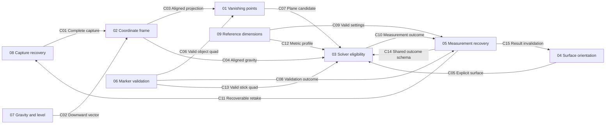

# App logic repair graph

This graph specifies the repairs for nine findings from the app logic review.
The implementation and C01–C15 checks now pass; the build properties record the
reviewed run. Source baseline for the original findings: commit `5a8e729`.
See the [completed run](../reviews/graph-loop-20260919T191526Z.md) for evidence,
worker history and the remaining physical-camera verification limits.

## Reading the graph

Open this folder as an Obsidian vault, or include it in an existing vault. The
Wikilinks connect the notes in Graph View. The diagram below labels each
directed edge with its contract ID; Obsidian's native graph does not display
custom edge labels. Contract definitions live in the producing node under the
matching `Cxx` heading. Consumers link back to that exact definition.

An arrow means **the producer must provide this guarantee to the consumer**.
It is not a promise that the implementation uses a direct function call, and it
does not imply a chronological implementation order. Map/navigation links are
not contracts. Contract IDs are stable; change a definition at its source and
review every consumer when its meaning changes.

## Nodes

| Review finding | Work node | Priority |
| --- | --- | --- |
| F1: valid wall views rejected | [[01-rectangle-vanishing-points]] | High |
| F2: image and gravity frames disagree | [[02-capture-coordinate-frame]] | High |
| F3: nonrectangles treated as rectangles | [[03-solver-eligibility-confidence]] | High |
| F4: floor mode unreachable | [[04-surface-orientation]] | High |
| F5: invalid stick can crash measurement | [[05-measurement-failure-handling]] | Medium |
| F6: collinear corners accepted | [[06-marker-geometry-validation]] | Medium |
| F7: upright level reads 180 degrees | [[07-gravity-direction-level]] | Medium |
| F8: capture error disables retry | [[08-capture-recovery]] | Medium |
| F9: non-finite dimensions accepted | [[09-reference-dimensions]] | Medium |

## Contract index

Each row points to the authoritative definition, including rejection behavior
and the assertion that verifies the edge.

| Edge | Producer | Consumer | Contract definition |
| --- | --- | --- | --- |
| C01 | 08 | 02 | [[08-capture-recovery#C01 Complete capture]] |
| C02 | 07 | 02 | [[07-gravity-direction-level#C02 Downward vector]] |
| C03 | 02 | 01 | [[02-capture-coordinate-frame#C03 Aligned projection]] |
| C04 | 02 | 03 | [[02-capture-coordinate-frame#C04 Aligned gravity]] |
| C05 | 04 | 03 | [[04-surface-orientation#C05 Explicit surface]] |
| C06 | 06 | 01 | [[06-marker-geometry-validation#C06 Valid object quad]] |
| C07 | 01 | 03 | [[01-rectangle-vanishing-points#C07 Plane candidate]] |
| C08 | 06 | 05 | [[06-marker-geometry-validation#C08 Validation outcome]] |
| C09 | 09 | 05 | [[09-reference-dimensions#C09 Valid settings]] |
| C10 | 03 | 05 | [[03-solver-eligibility-confidence#C10 Measurement outcome]] |
| C11 | 05 | 08 | [[05-measurement-failure-handling#C11 Recoverable retake]] |
| C12 | 09 | 03 | [[09-reference-dimensions#C12 Metric profile]] |
| C13 | 06 | 03 | [[06-marker-geometry-validation#C13 Valid stick quad]] |
| C14 | 05 | 03 | [[05-measurement-failure-handling#C14 Shared outcome schema]] |
| C15 | 05 | 04 | [[05-measurement-failure-handling#C15 Result invalidation]] |

## Shared conventions

- Image geometry uses one declared pixel frame. Camera coordinates are x-right,
  y-down, z-forward in that frame; physical gravity points down. The level
  overlay has a separate display-frame transform.
- Real lengths are metres internally; display units never change solver units.
  Marked object corners are ordered `[TL, TR, BR, BL]`. The current stick input
  is a four-corner box, not the five band points described in the original spec.
- All successful outputs must be finite. Invalid input, an ineligible solver,
  and an unsuccessful measurement are explicit outcomes, not zero-sized success.
- Node 03 owns solver eligibility and confidence. Node 05 defines the shared
  outcome schema and owns result invalidation and user-visible failure recovery;
  nodes 03, 04 and 08 use those contracts. Node 06 owns marker validation.
  Do not duplicate these rules in unrelated UI handlers.
- Existing pure packages remain free of Android dependencies. Implementation
  files remain within the repository's 200-line limit.

## Implementation sequence and completion

1. Node 05 first defines the shared outcome schema and result invalidation
   boundary. Establish marker and dimension validation (06, 09), then wire their
   failures into 05. This groups work; it does not authorize overlapping writes.
2. Repair capture recovery (08), gravity semantics (07), and frame alignment (02).
3. Implement vanishing-point support (01), surface selection (04), and selection
   rules with honest confidence (03).
4. The coordinator assigns an integration worker to run every edge assertion,
   including Android capture and marking flows. Unit-test success alone does
   not close an edge. Nodes awaiting a neighbour remain `blocked`, with local
   evidence and missing edge IDs recorded. When neighbours are ready, assign a
   fresh verification attempt (increment the counter); retain earlier evidence
   in history and verify the actual combined revision before marking `built`.

Specification readiness and verified implementation are separate properties.
Updating a specification alone does not establish that an app fix exists.

## Build control properties

The optional [small supervisor](../supervisor/README.md) now provides executable
task scheduling and process controls. Its explicit execution graph is separate
from the contractual edges above. When using it, `.supervisor/state.json` is the
live record of task attempts, agents, PIDs and timestamps; this Markdown
frontmatter is a reviewed snapshot, not an automatically synchronized live view.
Task checks are milestones. Graph nodes become `built` only after their full
integration evidence is reviewed. The coordinator reconciled this snapshot after
the passing run recorded above.

Every note has the same build properties. Work-note properties track that node;
this map's properties track the overall repair and its coordinating agent.

| Property | Meaning and required value |
| --- | --- |
| `spec_status` | Readiness of this specification; currently `ready` |
| `build_status` | `not-built`, `building`, `paused`, `blocked`, `failed`, `cancelled`, or `built` |
| `build_agent` | Unique agent/subagent identity responsible for this attempt; null before assignment |
| `build_pid` | Confirmed positive OS PID of the worker, if exposed; otherwise null |
| `build_pid_note` | `not-started`, `recorded`, or `host-managed` when the agent platform exposes no PID |
| `build_attempt` | Attempt counter; starts at 0 and increments on each fresh claim/retry |
| `build_started_at` | Actual UTC start of this attempt; null until work starts |
| `build_ended_at` | Actual UTC time the attempt finishes, fails, blocks, or is cancelled; null while active |
| `build_verified_at` | Actual UTC time acceptance and contract checks pass; null until verified |
| `build_requested_action` | Latest requested action: `none`, `start`, `pause`, `resume`, or `cancel`; pending while its ID exceeds the acknowledged ID |
| `build_request_id` | Per-node monotonically increasing request number, initially 0; never reset between attempts |
| `build_acknowledged_request_id` | Last fully performed or explicitly superseded request, initially 0 |
| `build_heartbeat_at` | Coordinator's actual UTC time of last confirmed worker contact; null before assignment |
| `build_files` | Reserved repository-relative write paths for this attempt, including files created by extraction/refactoring |
| `build_last_error` | Failure/blocker explanation; null when none |
| `build_evidence` | List of verification commands/results or repository-relative evidence links |

Timestamps use ISO 8601 UTC, `YYYY-MM-DDTHH:mm:ssZ`, read from the actual clock
by the worker or coordinator; a read-only clock tool is sufficient. Never fill
them with estimates. Record a launcher-confirmed worker PID; a short
shell or compiler PID is not the agent's PID. Hosted agents without exposed
process IDs retain null and use `host-managed`; their agent identity is required.

### Ownership and transitions

1. One coordinator is the sole writer of build metadata and history during a
   run. Users submit requests to it; workers submit claims, acknowledgements and
   evidence. It processes these messages serially. Direct concurrent YAML edits
   are unsupported: stop workers and reconcile them before resuming. Frontmatter
   alone is not an atomic process lock.
2. Before `building`, reserve `build_files`, record the agent/run identity, PID
   availability, incremented attempt and actual start time. Different nodes may
   not write the same file concurrently, including extracted helper files. A
   paused worker retains its reservations. Extend the reservation before a new
   path is edited; release it only after the worker and its child writes stop.
   For example, 04/05/06 share `MarkScreen.kt`, 07/08 share `CameraScreen.kt`,
   02/08 share `CameraHelpers.kt`, and 04/05/08 share `MeasureApp.kt`. The first
   authorized writer owns any required split to meet the 200-line code limit;
   later nodes consume that layout. The coordinator checks actual paths, not
   just this illustrative list.
3. Give every user action a new `build_request_id`; record its target attempt,
   action and received time in history. Workers acknowledge that exact ID and
   attempt, never clear `build_requested_action`, and never overwrite a newer
   request. The coordinator alone advances `build_acknowledged_request_id` after
   performance or a documented supersession. A late acknowledgement for pause
   must leave a newer cancel pending. Do not carry old-attempt actions into a
   fresh worker; explicitly resolve them in history first.
4. Check for control requests before every edit and build/test step, and at
   least every 15 seconds while active, including waits for long commands. After
   observing pause/cancel, issue no new writes or commands. Pause acknowledges
   only at a quiescent boundary; cancel stops the attempt's own child work too.
   Report any uninterruptible operation and keep the request pending until it
   actually stops. Resume returns the same live paused attempt to `building`;
   a worker restart creates a new attempt. Do not start a worker that cannot
   support this observation interval.
5. Confirm worker contact at least every 30 seconds, also while paused. After
   90 seconds without contact, the coordinator blocks the node and checks the
   original agent/run and process identity; a stored PID alone is insufficient.
   Do not reassign files while an old worker might still write. Once termination
   is confirmed, archive the attempt as failed/abandoned, inspect partial edits,
   and release reservations. If termination cannot be established, keep it
   blocked. A returning stale worker must stop until reauthorized. Coordinator
   loss also stops new worker writes until ownership is reconciled.
6. On failure, blockage, or cancellation, record the corresponding status,
   `build_ended_at`, and reason. Keep ownership and PID as historical identifiers;
   they do not prove that a process is still running. Never mark failure `built`.
7. Mark `built` only when implementation, acceptance checks, and connected edge
   checks pass. Record end/verification times and evidence. If integration is
   still blocked, record `blocked` with the missing contract checks.
8. Before retry, restart, or reassignment, append the prior attempt to Build
   history with agent, PID, start/end times, outcome, and evidence. Preserve old
   attempts; clear the new attempt's end/verification/heartbeat fields, stale
   errors and `build_evidence`. Re-reserve its write paths. Evidence from an old
   attempt is historical until explicitly revalidated on the current revision.
9. The map becomes `building` when coordinated implementation starts and `built`
   only when all nine work nodes and overall integration are verified. Record
   coordinator ownership separately from each worker's ownership.

These properties are a manual coordination protocol. Editing a request does not
itself launch, pause, or terminate a process; the assigned agent/coordinator must
acknowledge and perform it. Use the supervisor commands for the executable loop.

Before parallel work, exercise the protocol with two claims for one shared file,
pause followed by cancel before acknowledgement, a worker dying mid-command,
and a verification-only retry. None may lose a request, admit overlapping
writes, reclaim a live worker's files, or reuse stale success evidence.

## Evidence and limits

The preceding review ran 260 existing JVM tests successfully with an isolated
Kotlin/JUnit runner, and added temporary synthetic checks that exposed the
reported failures. Those checks are evidence, not committed regression tests.
Fixtures specified in these nodes must be built into durable tests during fixes.
Android builds, UI instrumentation, and physical-device behavior were not
verified by that review. Numeric examples are rounded observations of the old
behavior, not acceptance tolerances or real-camera accuracy guarantees.

The [original design](../superpowers/specs/2026-06-13-measure-app-design.md) and
[gravity plan](../superpowers/plans/2026-06-13-plan3-gravity-selector.md) supply
context. These repair contracts deliberately correct their assumptions that a
vanishing point at infinity is unusable and that gravity is always available.
This graph does not expand the work into detection redesign, PDF export, new
measurement tools, or release automation.

## Build history

### Verified run 2026-09-19T19:15:26Z

PIDs are historical; all workers have stopped and file reservations are released. Verification-only attempts reuse the completed worker identity. [Run report](../reviews/graph-loop-20260919T191526Z.md) records the evidence and limits.

| Task / attempt | Worker PID | Start UTC | End UTC | Outcome |
| --- | --- | --- | --- | --- |
| integration/1 | 501689 | 2026-09-19T18:17:46Z | 2026-09-19T18:43:21Z | failed |
| integration/2 | 501689 | 2026-09-19T18:48:01Z | 2026-09-19T18:50:33Z | failed |
| integration/3 | 501689 | 2026-09-19T18:52:37Z | 2026-09-19T18:54:37Z | failed |
| integration/4 | 501689 | 2026-09-19T19:03:14Z | 2026-09-19T19:09:04Z | failed |
| integration/5 | 501689 | 2026-09-19T19:10:26Z | 2026-09-19T19:12:19Z | failed |
| integration/6 | 501689 | 2026-09-19T19:13:23Z | 2026-09-19T19:15:26Z | passed |
